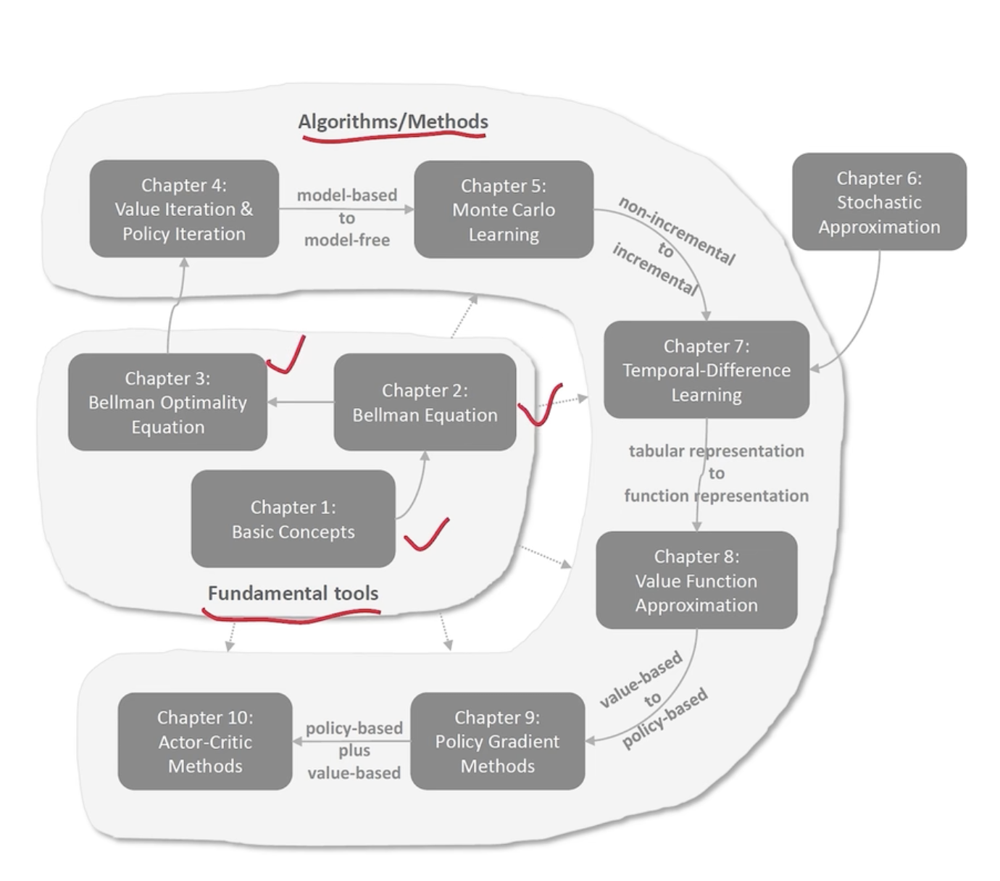

# 一张图掌握强化学习

前面的基础一点 

chapter1:Markov chain MDP

chapter2:贝尔曼公式：一个等式 一个方程 衡量策略 求解给定策略的状态值 “策略评价”

chapter3:贝尔曼最优公式 求解最优策略 
不动点定理 fixed point 值迭代算法 

上面是基础工具

chapter4: 三大算法 value iteration policy iteration truncated iteration 

chapter5:蒙特卡洛方法 model free learning

chapter6:时序差分  

